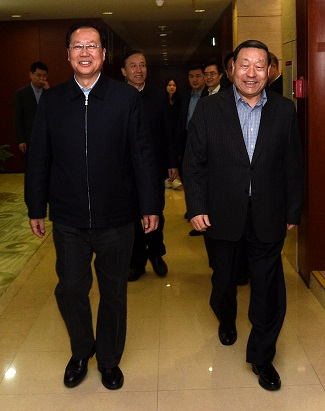
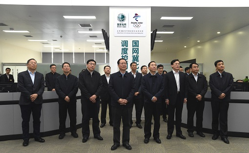
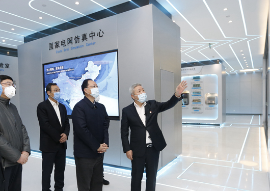
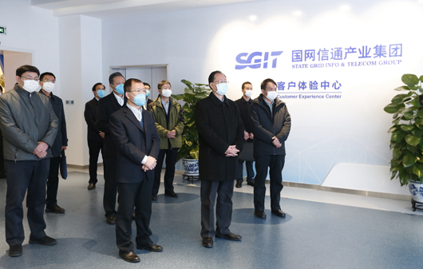
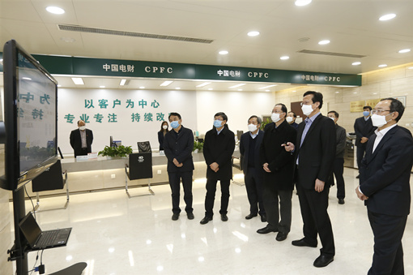

# 巨大变化，寓意何为？

<u>——国网换帅毛伟明，从何掌舵这艘共和国长子巨轮？</u>

<u>阿嘀 2020-2-14</u>

------

新旧交替，万物轮回。

在这冬去春来的微妙时节，电力行业可是闹出一些不小动静，先是国网[826号](https://mp.weixin.qq.com/s/PjY-dUNF1UP6LYNjlObVgA)文出台提出“三严禁、二不得、二不再”的投资建设思路；紧接着在元月份，国家电网公司网宣公司董事长换帅。而这距寇伟官宣董事长才过去仅仅13个月。这可能是电力行业在2020年1月份最最重要的新闻和动态了。

巨大变化，寓意何为？

换帅之后，该去何处？

### 国网换帅

2020年1月17日上午，国家电网有限公司召开中层以上管理人员大会。中央组织部有关负责同志宣布了中央关于国家电网有限公司董事长、党组书记调整的决定：毛伟明同志任国家电网有限公司董事长、党组书记，免去其江西省委常委、委员和副省长职务；免去寇伟同志的国家电网有限公司董事长、党组书记职务，另有任用。上述职务任免按有关法律和章程的规定办理。

这是国网公司网站于2020年1月17日发布的新闻内容。紧接着，各大平台、自媒体发布了对此事的诸多看法及猜测，甚是热闹，真假难辨。我们简单整理了下相关讯息链接：

> 财经杂志：江西省副省长毛伟明出任国网公司董事长成首个非电力行业出身一把手；

> 经济日报-中国经济网：[国家电网再换帅！江西副省长毛伟明接棒寇伟！](http://www.ce.cn/cysc/rs/yqrs/202001/17/t20200117_34147296.shtml)

> 智汇光伏：[官宣：国家电网迎来新掌门人——毛伟明，利好新能源！](https://mp.weixin.qq.com/s/g5qt8C9jkIYdGYNCACagAw)

> 澎湃新闻  SOLARZOOM光储亿家：[不寻常！时隔一年国网再换帅：寇伟调离、江西副省长毛伟明接任！](https://mp.weixin.qq.com/s/UhT4m60HnUGV3pbEHv4XGQ)

> 全球电力资讯榜：[国家电网一把手换人了，接任者毛伟明，会对电网改革产生什么样的影响？](https://mp.weixin.qq.com/s/xpj_gaDpaWMMWGGDAYKXJQ)

> 全球电力资讯榜：[国家电网新董事长毛伟明履历曝光！](https://mp.weixin.qq.com/s/0Kwc5EU3rc7rgYD70hP4kg)

......

此类新闻或报道居多，不一一列举！

大部分文章除了表达“突发”之意外，更多的是对下一步的猜测和担忧！众所周知，寇伟在任力推电力网联网，调整国网“三型两网”战略发展方向，但在2019年的内外交困压力下并未取得很好的利润目标，下属十几个单位未实现盈利。所以，换帅之后，国网的电力物联网发展浪潮何去何从？国网政策是否延续推进？特高压及低压配电网投资能否继续？以及对于电网公司企业内部会进行哪些变化？......这都引发了业界诸多猜测。

### 最新动态

2020年1月注定是个不一般的元月。在喜迎春节之际，全国进入抗击新冠的战“疫”之中。今天，已距离1月17日毛伟明董事长章帅还不足一个月，我们很关切新官上任后的具体动态，以便能够更早的探究以上疑惑之答案！

好，我们整理了毛伟明董事长自1月17日上任后到2月12日期间，工作安排的部分行程及讲话内容，梳理提供了最真实的一手信息，以便您直接分析和思考背后的意义。

> **1月17日   [国家电网有限公司董事长、党组书记调整](http://www.sgcc.com.cn/html/sgcc_main/col2017021449/2020-01/17/20200117113216940922733_1.shtml)，毛伟明任董事长。**

> **1月19日	["公司党组书记、董事长毛伟明主持召开公司党组会议——坚决践行初心使命 推进全面从严治党向纵深发展。](http://www.sgcc.com.cn/html/sgcc_main/col2017021449/2020-01/20/20200120101353357932125_1.shtml)**

毛伟明主持会议并讲话，除了政治学习“不忘初心、牢记使命”，增强“四个意识”、坚定“四个自信”、做到“两个维护”，特别提到：要坚决践行国家电网的初心使命，提高政治站位，牢记党中央设立国家电网的初心和国有企业“六个力量”新的历史定位，把服务党和国家工作大局作为根本任务，切实增强服务质效，全力保障能源安全，使公司成为党和国家最可信赖的依靠力量。

> **1月19日	["毛伟明走访慰问离退休老同志——向老同志致以新春问候和节日祝福"。](http://www.sgcc.com.cn/html/sgcc_main/col2017021449/2020-01/20/20200120171714699102677_1.shtml)****

慰问离退休老同志：黄毅诚、史大桢、刘振亚，亲切交流，一起回顾电力发展史。

> **1月22日	["毛伟明辛保安视察春节保电工作慰问一线员工](http://www.sgcc.com.cn/html/sgcc_main/col2017021449/2020-01/22/20200122132305637992261_1.shtml)——确保电网安全和优质服务 让人民群众过一个欢乐祥和的新春佳节"。**

毛伟明到华北分部、国网冀北电力、国网北京电力慰问一线员工，毛伟明强调，要提高政治站位，确保政治用电，切实做好首都地区重要用户供电保障工作。要强化组织领导，确保春节安全，将各项措施落细落小落实。要强化责任担当，推进管理创新、技术创新、服务创新，持续优化营商环境，激发基层首创精神，深化“放管服”改革，确保党中央、国务院决策部署落地见效。

> **1月23日	["毛伟明辛保安赴国调中心检查慰问——以实际行动践行人民电业为人民宗旨"。](http://www.sgcc.com.cn/html/sgcc_main/col2017021449/2020-01/23/20200123161547492408400_1.shtml)****

毛伟明到国家电力调度控制中心检查慰问，毛伟明强调，作为电网企业，为人民美好生活提供安全可靠的电力保障是我们的重大责任，也是我们的光荣使命，更是我们的价值所在。各部门、各单位要认真落实各项保电措施，精心开展电网调度，合理安排运行方式，周密做好应急准备，千方百计确保大电网安全运行和可靠供电，尤其要全力做好新型冠状病毒感染疫情防控，以及电力清洁取暖、扶贫、农民返乡过节等民生用电，以实际行动践行人民电业为人民的企业宗旨，用辛勤的汗水让人民群众过一个亮亮堂堂、欢乐祥和的春节。

> **1月28日	["毛伟明辛保安与华中分部湖北公司武汉公司视频连线——增强必胜信心 坚决打赢疫情防控阻击战。"](http://www.sgcc.com.cn/html/sgcc_main/col2017021449/2020-01/29/20200129123023551705957_1.shtml)****

毛伟明远程视频连线国网华中分部、国网湖北电力、湖北武汉供电公司，毛伟明指出，疫情防控已进入关键时期，打赢疫情防控阻击战是当前各项工作最重要的任务，是华中分部、湖北公司、武汉公司的头等大事、最紧迫的工作。

> **2月1日	["毛伟明董事长到中国电科院、国网管理学院、国网大学检查疫情防控工作——提高政治站位 强化全员防控 坚决打赢疫情防控阻击战"。](http://www.sgcc.com.cn/html/sgcc_main/col2017021449/2020-02/01/20200201182942917706489_1.shtml)**

毛伟明在中国电科院、国网管理学院、国网大学调研中国电科院国家电网仿真中心，并讲话：中国电科院要进一步加大电网科技创新工作力度，打通人才链、创新链、技术链、价值链、资金链，深化产学研相结合，培育核心竞争力，为大电网安全稳定运行提供可靠保障。同时，要针对人才密集型企业特点，紧密结合业务布局点多面广、驻湖北机构员工较多的实际，切实加强疫情防控工作。在国网管理学院和国网大学，毛伟明指出，国网管理学院和国网大学承担着公司干部、员工培训和人才培养的重要任务，做好疫情防控工作尤为重要，严格校区管理，强化综合防治，采取线上线下相结合的培训模式，保证员工和培训学员身体健康。

> **2月4日	["毛伟明董事长到北七家办公区检查疫情防控工作并开展调研——坚定信心 精准施策 将疫情防控各项措施落细落小落实"。](http://www.sgcc.com.cn/html/sgcc_main/col2017021449/2020-02/04/20200204184939325670709_1.shtml)****

毛伟明调研北七家办公区的大功率电力电子器件实验室、国家能源特高压直流输电工程成套设计研发（实验）中心、信产集团客户体验中心、全球能源研究统一平台、通航公司调度控制中心等单位，毛伟明指出，各单位在疫情防控工作中，认真落实公司党组部署，思想重视、组织严密、安排周密、措施有力；在服务公司改革发展中，锐意创新突破，提供了有力的科技支撑、智力支持和运营保障，值得充分肯定。并要求多串宣传、少扎堆、严排查、查细节。

> **2月6日	["毛伟明董事长、辛保安总经理与华中分部、湖北公司、武汉公司、黄冈公司、孝感公司视频连线——再接再厉 全力以赴 为打赢疫情防控阻击战作出更大贡献。"](http://www.sgcc.com.cn/html/sgcc_main/col2017021449/2020-02/06/20200206174257018664105_1.shtml)**

毛伟明连线湖北公司进行慰问并要求：第一，要用习近平总书记重要讲话精神统一思想行动。第二，供电保障要坚强、可靠。第三，防控措施要周密、细致。第四，党建优势要强化、发挥。第五，舆论宣传要鲜明、生动。

> **2月10日	["公司党组理论学习中心组（扩大）传达学习——习近平总书记在中央全面依法治国委员会第三次会议上的重要讲话精神——公司党组理论学习中心组（扩大）传达学习。"](http://www.sgcc.com.cn/html/sgcc_main/col2017021449/2020-02/10/20200210184222991156006_1.shtml)****

毛伟明传达学习习近平总书记在中央全面依法治国委员会第三次会议上的重要讲话精神，结合实际抓好贯彻落实工作。要深刻领会、准确把握好习近平总书记重要讲话精神要义。要求三点：一是从法治建设来体现以人民为中心的发展思想。二是以依法治国为疫情防控提供有力保障。三是以大考的要求提升治理体系和治理能力。

> **2月10日	[毛伟明董事长到北京电力医院、白广路办公区检查疫情防控工作并开展调研。](http://www.sgcc.com.cn/html/sgcc_main/col2017021449/2020-02/11/20200211092312989193901_1.shtml)****

毛伟明在北京电力医院门诊大厅进行抗疫慰问，并在白广路办公区听取了国网中兴公司工作汇报，调研了国网信息通信调度监控中心、国网新源公司综合监控应急中心，详细了解信息通信调度监控、抽水蓄能生产、节后重点工程复工安排等情况。毛伟明强调要认真落实好公司党组关于疫情防控“一个提升、六个强化”的要求，将各项措施落细落小落实。要坚持以人为本，提高防范意识，做好物资保障，加强人文关怀，确保员工安全健康。

> **2月11日	["毛伟明董事长到英大国际大厦办公区、国网国际公司检查疫情防控工作并开展调研——坚决打赢疫情防控的人民战争总体战阻击战"。](http://www.sgcc.com.cn/html/sgcc_main/col2017021449/2020-02/11/20200211202739671190793_1.shtml)**

毛伟明董事长到英大国际大厦办公区、国网国际公司考察调研，旗下英大集团、中国电财、英大财险、英大人寿、英大信托分别进行了工作汇报。毛伟明强调，要围绕服务实体经济、防范化解风险、深化金融改革三大任务，持续壮大公司金融业务综合实力，有效管控各类金融风险，积极把握绿色金融、科技金融、普惠金融、供应链金融等新业态新方向，应用现代科学技术提升金融服务能力和水平，为公司主业主责发展提供金融支撑。而对海外业务发展、人才队伍建设、思想文化建设在充分肯定之外，他强调，要充分发挥技术、管理、品牌等方面的综合优势，为服务“一带一路”建设作出更大贡献。

> **2月12日 [毛伟明董事长到鲁能集团、国网物资公司检查疫情防控工作并开展调研——坚定信心 有力有序 统筹抓好疫情防控和复工复产工作](http://www.sgcc.com.cn/html/sgcc_main/col2017021449/2020-02/13/20200213143227365299369_1.shtml)。**

毛董事长详细询问应急物资采购、调配等情况。他来到物资供应商服务中心，了解集中招标流程、服务模式等情况，对物资公司主动作为，做好应急采购、保障物资供应给予充分肯定。他强调，要创新方法，在深入推进“放管服”改革的基础上，充分利用信息化、智能化手段提升物资供应效率，做好流程再造、模式创新。

........

通过以上毛伟明董事长的行程来看，在不足一个月的时间，毛伟明的行程还是很满，开会、调研、慰问，马不停歇，可以看出他是一个很务实的领导。在以上考察指导和公开的讲话表态中，我们可以看出：

**1、政治觉悟要高。**不论开会还是视察讲话，我们都可以看出，保持与党的同步性是所有领导必须要有的政治觉悟。作为国家大型央企——共和国的长子，国网公司的地位不言而喻，当下，就需要不忘初心、牢记使命，深刻学习并践行人民电力为人民的企业宗旨，承担大型国有企业的国家及社会担当。

**2、疫情紧急重大事情要先。**疫情当下，毛伟明每到一处都特别强调当下的紧急重要任务就是抗击疫情，在必须保障用电稳定、可靠的同时，还不忘时时提醒和要求员工注意自身安全。并在第一时间与湖北电网公司两次进行视频连线进行慰问，体现企业领导人的人性关怀。

**3、调研了解学习，使自己深入其中**。同时，我们看到，毛伟明现场考察了多个单位和业务部门，我相信这些都是国网当下最核心的业务之一，也是当下最容易去考察的地方，当然从中我们也看到，毛伟明在不断的考察活动中也是在逼着自己深入学习和了解国网公司的业务范围及情况，以便更好、更全面、更快的了解企业实际状况。

**4、立足岗位，延续业务重点**。在调研过程中，我们发现，毛伟明暂时并没有提出新的概念和方向，主要强调跟党走、战疫情、立足岗位三个工作重点，这也给“突发”中的公司所有人员一颗定心丸，自足本职、恪尽职守，才能攻坚克难。

至于公司未来是否会做战略调整、业务变革，我们暂时还不得而知，但我们相信这也是摆在毛伟明董事长面前的考题。领导认命他来掌舵国网这艘航母，必然有其原因，也必然有毛伟明亟待解决的问题，但是，时间还短，我们要有耐心，也将拭目以待。

## 扩展阅读

电力设备状态监测在2月13日发布了题为《[**毛伟明董事长在国网公司2020年第8次党组会议上的讲话释放的信号**](https://mp.weixin.qq.com/s/i7NDCAR4TBOH57k7Enwozw)》的文章，分析当前主要工作重点集中在以下三点，我们一起分享，供大家参考。

> **-要提高站位抓落实**

自觉把思想和行动统一到中央决策部署上来，围绕中心、服务大局，以实际工作成效彰显国家电网的责任担当。

> **-要紧盯目标抓落实**

结合各部门工作实际，明确任务时间表、路线图，层层压实责任，逐级传递压力，确保各项工作有力有序有效开展。

> **-要凝心聚力抓落实**

依靠广大干部职工，充分调动大家的积极性、主动性、创造性，凝聚团结奋进、攻坚克难的强大合力，确保每项工作都落得下、落得实、落得好。

<!--扩展阅读部分的内容来源自电力设备状态监测微信公众号，欲了解完整内容，请点击题目链接查看全文！-->

------

**欲关注、下载、学习更多电力动态及资料，邀请您一起加入知识星球【阿嘀电老虎图书馆】放纵驰骋。**

*<u>阿嘀电老虎，实际是一个电力资料图书馆，其中有不断更新加载的最新电力动态、国网信息、文件标准、招投标信息以及你可以在其中查询下载并学习的各种资料，包括：文件标准、电力知识、电网主设备、配用电物联网、电力在线监测、电力工程安全、行业展会论坛、新产品技术等方面资料。</u>*
*<u>希望与您，在此：</u>*

*<u>关注，熟悉你有的！</u>*

*<u>学习，获得你想的！</u>*

*<u>实践，成长你要到！</u>*

*<u>一起学习，一起分享，共同提高！！！</u>*

